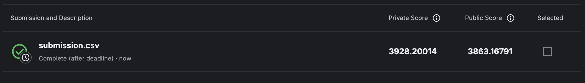
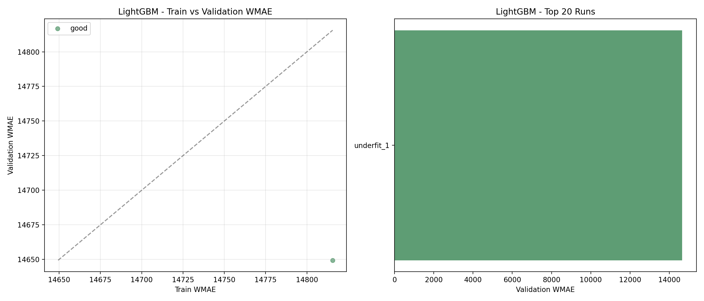
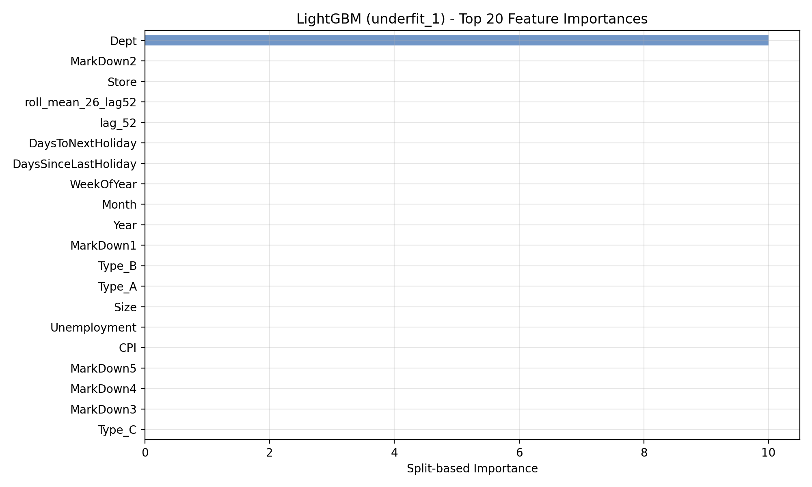
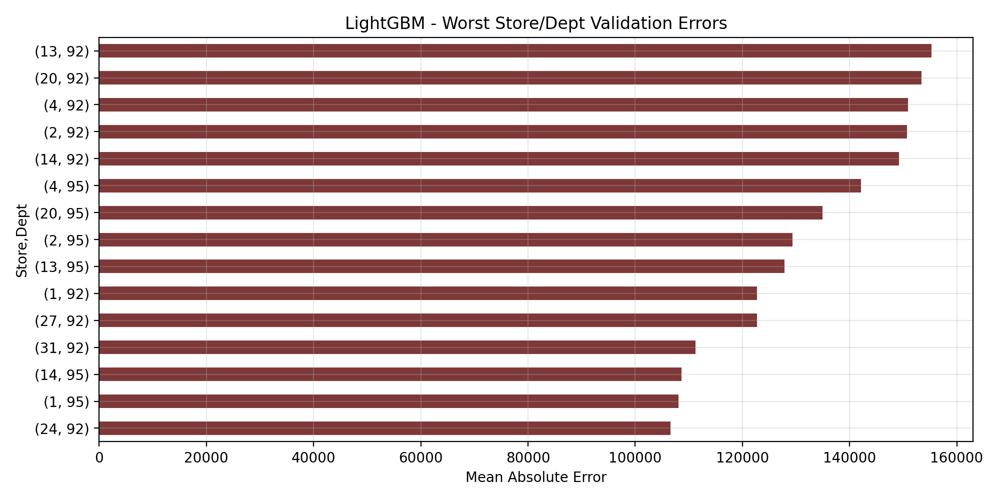
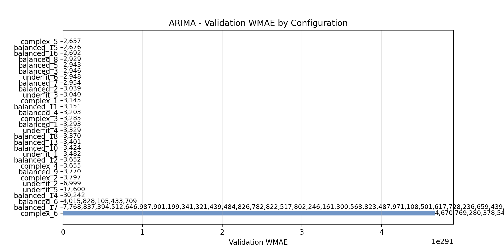
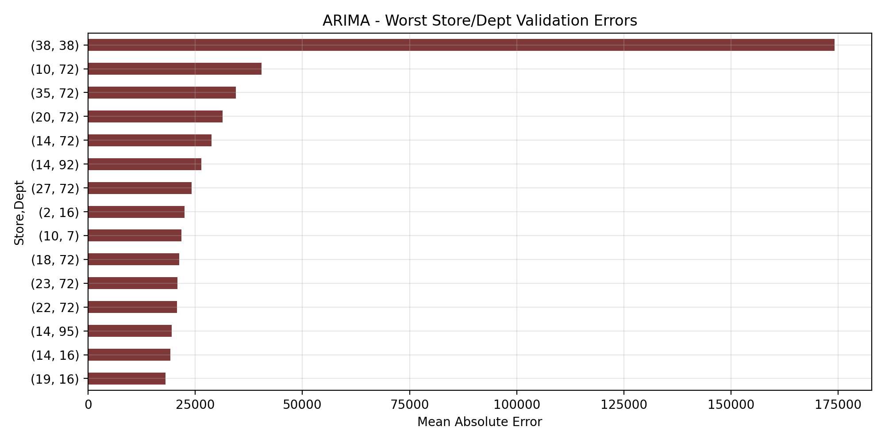

# ml-final-project-walmart-store-sales-forecasting

## Kaggle-ის საბოლოო შედეგი

- **Private Score:** `3,928.20`
- **Public Score:** `3,863.17`

Submission აწყობილია საუკეთესო შიდა validation შედეგის მქონე მოდელზე,`XGBoost` (`overfit_5` configuration). საინტერესოა, რომ რეალურ Kaggle test set-ზე მიღებული score (`~3,928`) საგრძნობლად მაღალია, ვიდრე ჩვენი შიდა validation WMAE (`1,709.59`),ეს მოსალოდნელია, რადგან Kaggle-ის leaderboard სრულიად უცნობ test period-ს იყენებს, რომელიც ჩვენს time-based validation window-ს არ ემთხვევა და, შესაძლოა, განსხვავებულ სეზონურ pattern-ებს შეიცავდეს.

## მონაცემების წინასწარი დამუშავება

### NaN მნიშვნელობები

- `MarkDown1`–`MarkDown5`,NaN მნიშვნელობები შეივსება 0-ით, რადგან NaN ნიშნავს რომ მოცემულ კვირაში ფასდაკლება არ ყოფილა.
- `CPI`, `Unemployment`,შეივსება Forward filling / Backward filling მეთოდის გამოყენებით თითოეული მაღაზიისთვის ცალ-ცალკე, რადგან ისინი დროზე დამოკიდებული ცვლადებია.
- `Temperature`, `Fuel_Price`,არ გვაქვს NaN მნიშვნელობები.

## Feature Engineering For All Models

ქვემოთ მოცემული პუნქტები აღწერს როგორ ვამუშავებთ მონაცემებს ყველა მოდელისთვის. თუმცა კონკრეტულ მოდელს შეიძლება კიდევ დამატებით სხვანაირად დასჭირდეს მონაცემთა დამუშავება, ამიტომ ასეთი ტიპის გარდაქმნებს თვითონ ამ მოდელის განხილვის დროს აღვწერთ.

### 1. დროის ცვლადები

ვინაიდან საცალო ვაჭრობა მკვეთრად სეზონურია, ყველა მოდელისთვის სასარგებლოა იმის ცოდნა, კვირა წლის რომელ მონაკვეთში ხვდება. გაყიდვებზე დიდ გავლენას ახდენს დროის პერიოდში არსებული მნიშვნელოვანი მოვლენები (Holidays - ახალი წელი, მადლიერების დღე და ა.შ.)

**დამატებული სვეტები (`add_time_features`):**

იმისათვის რომ თითოეულ მაღაზიაზე და დეპარტამენტზე მოცემული თარიღები მოდელისთვის უფრო აღქმადი იყოს დავამატეთ ცვლადები:
- `Year`, `Month`, `WeekOfYear` - თარიღის ძირითადი დაშლა რიცხვით კომპონენტებად.

საინტერესოა იმ ფაქტის ცოდნა თუ რამდენად ახლოს ვართ რომელიმე მნიშვნელოვან მოვლენასთან. მაგალითად გაყიდვები იზრდება ახალი წლისთვის სამზადისის პერიოდში. ეს პერიოდი გავლენას ახდენს გაყიდვებზე თუმცა მხოლოდ `IsHoliday` ცვლადით ვერ გავითვალისწინებდით მათ. ამის გამო გადავწყვიტეთ დავამატოთ ცვლადები:

- `DaysSinceLastHoliday` - რამდენი დღე გავიდა ბოლო მნიშვნელოვანი მოვლენიდან. 
- `DaysToNextHoliday` - რამდენი დღე დარჩა შემდეგ მნიშვნელოვან მოვლენამდე. 

### 2. მაღაზიის მონაცემები

**დამატებული სვეტები (`add_store_features`):**

- `Type_A`, `Type_B`, `Type_C` - მაღაზიის ტიპის One-hot encoding-ის გამოყენებით, რადგან 3 ტიპი გვაქვს მაღაზიებისთვის და მხოლოდ 3 boolean სვეტის დამატება გვიწევს.
- `Size` - მაღაზიის ფართობი.

### 3. IsHoliday კოდირება

**(`encode_is_holiday`):**

`IsHoliday` სვეტი თავდაპირველად Boolean არის (`True`/`False`). ყველა მოდელისთვის გარდავქმნით მას მთელ რიცხვად (`1`/`0`), რათა მოდელმა შეძლოს მისი გამოყენება.

### 4. features.csv-ის დამერჯვა

**(`merge_features`):**

`features.csv` იმერჯება train და test მონაცემებთან `Store` და `Date` სვეტების მიხედვით, რათა თითოეულ სტრიქონს დაემატოს `Temperature`, `Fuel_Price`, `CPI`, `Unemployment` და `MarkDown1`–`MarkDown5`.

## რატომ ვყოფთ კონფიგურაციებს Underfit / Balanced / Overfit კატეგორიებად

თითქმის ყველა მოდელისთვის (გამონაკლისია მხოლოდ TimesFM, რომელიც საერთოდ არ ივარჯიშება Walmart-ის მონაცემებზე) hyperparameter sweep-ს სამ კატეგორიად ვყოფთ:

- **Underfit**,შეგნებულად "სუსტი" კონფიგურაციები: მცირე capacity (მცირე `hidden_size` / `n_blocks` / order), ცოტა training step, აგრესიული regularization. მიზანია დავინახოთ, როგორ იქცევა მოდელი, როცა მას საკმარისი "ტევადობა" არ აქვს historical pattern-ების დასაჭერად.
- **Balanced**,გონივრული, საშუალო სირთულის კონფიგურაციები, საიდანაც საბოლოოდ ვირჩევთ production მოდელს.
- **Overfit**,შეგნებულად "ზედმეტად ძლიერი" კონფიგურაციები: დიდი capacity, ბევრი training step, მინიმალური ან ნულოვანი regularization. მიზანია დავინახოთ, სად იწყება train set-ზე overfitting და validation performance-ის გაუარესება.

ეს დაყოფა საჭიროა, რადგან ერთი კონფიგურაციის validation WMAE-ის ცოდნა საკმარისი არ არის იმის გასაგებად, *რატომ* მუშაობს ის კარგად ან ცუდად. სამივე რეჟიმის ერთმანეთთან შედარება ცხადად გვაჩვენებს bias-variance trade-off-ს: თუ underfit და overfit ორივე მკვეთრად ჩამორჩება, ხოლო balanced საუკეთესოა,ეს ადასტურებს, რომ ჩვენი "balanced" არჩევანი შემთხვევითი კი არ არის, არამედ რეალურად წარმოადგენს ტევადობის ოპტიმალურ წერტილს ამ კონკრეტული feature set-ისა და validation window-სთვის.

**კლასიკური სტატისტიკური მოდელებისთვის (ARIMA, SARIMA) ტერმინოლოგია ოდნავ განსხვავებულია.** ეს მოდელები gradient descent-ით არ ვარჯიშობენ, ამიტომ "overfit" ნეირონული ქსელის მნიშვნელობით მათთვის ნაკლებად რელევანტურია,მის ნაცვლად მაღალი `(p,d,q)` order უბრალოდ ზრდის numerical instability-ის რისკს likelihood-ის მაქსიმიზაციის დროს. ამიტომ ARIMA/SARIMA-ს sweep-ებში "overfit" კატეგორიის ნაცვლად "**complex**" გვაქვს.

### როცა "overfit" კონფიგურაცია ნამდვილად ზედმეტად ხდება

ARIMA-ს sweep-ში რამდენიმე მაღალი სირთულის კონფიგურაცია იმდენად არასტაბილური აღმოჩნდა, რომ validation WMAE ასტრონომიულ მნიშვნელობებამდე აიწია,ეს აღარ არის უბრალო overfitting, არამედ ნამდვილი numerical divergence:

| Config | Order | Validation WMAE |
|---|---|---:|
| `balanced_6` | `(2,1,1)` | `4.02 × 10¹⁵` |
| `balanced_17` | `(2,1,1)`, `concentrate_scale=True` | `7.77 × 10¹⁰²` |
| `complex_6` | `(4,1,2)`, `concentrate_scale=True` | `4.67 × 10²⁹¹` |

ეს ხდება, როცა state-space optimizer-ი ვერ converge-დება და unit circle-ს გარეთ root-ებზე "იჭერს",მიღებული პროგნოზი ტექნიკურად კვლავ სასრული (finite) რიცხვია, ამიტომ ჩვენი safety check (`is_valid_forecast`, რომელიც forecast-ს series-ის საკუთარ scale-თან ადარებს) ზოგჯერ ვერ იჭერს ამ divergence-ს, თუ თავად series-ის scale საკმარისად დიდია. სხვა სიტყვებით, ზოგიერთი "overfit"/"complex" კონფიგურაცია ნამდვილად "ზედმეტად ბევრი" აღმოჩნდა მოდელისთვის გასამკლავებლად. სწორედ ეს არის კარგი მაგალითი იმისა, თუ რატომ არასდროს ვირჩევთ production მოდელს ერთი შემთხვევითი configuration-ის გაშვების საფუძველზე,მხოლოდ underfit/balanced/overfit სამივე რეჟიმის სისტემური შედარება გვაჩვენებს ასეთ failure mode-ებს დროულად.

## DLinear მოდელი

DLinear გამოვიყენეთ როგორც time-series forecasting მოდელი, რომელიც კარგად ერგება Walmart-ის ტიპის weekly sales forecasting ამოცანას. მონაცემები გადავიყვანეთ `NeuralForecast`-ის long format-ში, რადგან DLinear თითოეულ Store-Dept სერიას ცალკე time series-ად ხედავს:

- `unique_id` - ერთი time-series თითოეული `Store` + `Dept` წყვილისთვის.
- `ds` - კვირის თარიღი.
- `y` - სამიზნე ცვლადი, ანუ `Weekly_Sales`.

DLinear-ის მთავარი იდეაა, რომ time-series იყოფა ორ ნაწილად: trend კომპონენტად და seasonal/remainder კომპონენტად. შემდეგ ორივე კომპონენტზე გამოიყენება მარტივი linear projection, რომელიც ბოლო ისტორიული ფანჯრიდან პროგნოზირებს მომავალ კვირებს. ეს არქიტექტურა ბევრად უფრო მარტივია, ვიდრე დიდი recurrent ან attention-based მოდელები, მაგრამ ძლიერი baseline არის ისეთი მონაცემებისთვის, სადაც ისტორიული გაყიდვების pattern-ები, სეზონურობა და store-department-ის სპეციფიკური ჩვევები ძალიან მნიშვნელოვანია.

### რატომ ვიყენებთ მხოლოდ ისტორიულ ინფორმაციას

DLinear-ის ამ ექსპერიმენტში მოდელს ვაწვდით მხოლოდ ისტორიულ `Weekly_Sales` მნიშვნელობებს. ანუ, თითოეული `Store-Dept` სერიისთვის მოდელი იღებს წარსული 52 კვირის გაყიდვებს და ამ history-ზე დაყრდნობით პროგნოზირებს შემდეგ 39 კვირას.

DLinear-ის არქიტექტურა ძალიან მარტივია: ის input window-ს შლის trend და seasonal ნაწილებად და შემდეგ linear layer-ების საშუალებით ასახავს ამას მომავალ horizon-ზე. ამ მოდელში არ გვაქვს ცალკე decoder ან attention მექანიზმი, სადაც მომავალ კვირებზე ცნობილი ცვლადები ცალკე შევიდოდა. ამიტომ DLinear-ისთვის ყველაზე ბუნებრივი setup არის history-based forecasting: მოდელი სწავლობს წარსული გაყიდვების pattern-ებს და მომავალის პრედიქციას ახდენს.

ეს მიდგომა სწორია forecast ამოცანისთვის, რადგან validation და test პროგნოზის დროს მოდელმა უნდა გამოიყენოს მხოლოდ ის ინფორმაცია, რომელიც პროგნოზის მომენტში რეალურად ხელმისაწვდომია. 

ამიტომ DLinear-ის საბოლოო ვერსია არის `target_history_only`: input-ში გვაქვს მხოლოდ `unique_id`, `ds` და `y`. ეს არ ნიშნავს, რომ სხვა features უსარგებლოა, უბრალოდ ამ მოდელის მიზანია გვაჩვენოს, რამდენად ძლიერი პროგნოზი შეიძლება მივიღოთ მხოლოდ historical sales pattern-ებიდან.

### Train/Validation setup

DLinear შევაფასეთ time-based validation-ით. მოდელი ვავარჯიშეთ ძველ კვირების ინფორმაციაზე და შემდეგ, ახალ კვირებზე შევამოწმებთ. ასეთი split აუცილებელია forecasting ამოცანაში, რადგან რეალურ ცხოვრებაშიც წარსულით ვცდილობთ მომავლის პროგნოზირებას.

validation setup:

- Train პერიოდი: `2010-02-05`-დან `2012-01-27`-მდე
- Validation პერიოდი: `2012-02-03`-დან `2012-10-26`-მდე
- Input window: `52` კვირა, ანუ მოდელი ყოველი პროგნოზისთვის უყურებს ბოლო ერთ წელს
- Forecast horizon: `39` კვირა, რაც ემთხვევა test set-ის კვირების რაოდენობას
- Frequency: weekly Friday (`W-FRI`)

მონაცემებში ყველა `Store-Dept` სერიას ერთნაირი რაოდენობის კვირები არ ჰქონდა. DLinear-ის cross-validation რომ სტაბილურად გაშვებულიყო, train/evaluation ნაწილში გამოვიყენეთ სრული ისტორიის მქონე სერიები:

- სულ Store-Dept time series: `3331`
- სრული ისტორიის მქონე რიგები: `2660`
- მოკლე ან არათანაბარი სერიები, რომლებიც DLinear train/evaluation-იდან ამოვიღეთ: `671`

საბოლოო prediction pipeline-ში მოკლე სერიებისთვის fallback ლოგიკაც დავამატეთ. თუ DLinear კონკრეტულ `Store-Dept` წყვილზე პროგნოზს ვერ აბრუნებს, ვიყენებთ ამ სერიის ბოლო ცნობილ `Weekly_Sales` მნიშვნელობას. თუ არც ეს არსებობს, ვიყენებთ გლობალურ median fallback-ს (`7,612.03`).

### Hyperparameter search

გავუშვით DLinear-ის რამდენიმე configuration და ისინი დავყავით underfit/balanced/overfit.

ასეთი დაყოფა დაგვეხმარა გვენახა, როგორ რეაგირებს DLinear სხვადასხვა სირთულის setup-ზე. Underfit configuration-ები გვაჩვენებს შემთხვევებს, სადაც მოდელი ზედმეტად მარტივია და historical pattern-ებს საკმარისად ვერ სწავლობს. Overfit configuration-ები პირიქით, გვაჩვენებს შემთხვევებს, სადაც მოდელი train მონაცემს ზედმეტად ერგება და validation-ზე უარესად მუშაობს. Balanced configuration-ების მიზანი იყო ამ ორ უკიდურესობას შორის უკეთესი trade-off-ის პოვნა, სადაც validation WMAE ყველაზე დაბალია.

ამ შედარებამ გვაჩვენა, რომ DLinear-ისთვის საუკეთესო შედეგი არ მოდის უბრალოდ უფრო დიდი ან უფრო ხანგრძლივად ნავარჯიშები მოდელიდან. უკეთესი შედეგი მივიღეთ მაშინ, როცა input window, moving average window და training steps ერთმანეთთან დაბალანსებული იყო.

ეს ბალანსი შემთხვევით არ აგვირჩევია. საუკეთესო configuration იყო ის, სადაც მოდელს საკმარისი ისტორია ჰქონდა სასარგებლო pattern-ების დასასწავლად, მაგრამ არც ისე დიდი complexity ან training steps, რომ train set-ზე ზედმეტად მორგებულიყო.

ძირითადი tuning parameters იყო:

- `input_size`
- `moving_avg_window`
- `max_steps`
- `learning_rate`
- `batch_size`

საუკეთესო run იყო `balanced_2`:

| პარამეტრი | მნიშვნელობა |
|---|---:|
| `input_size` | `52` |
| `moving_avg_window` | `13` |
| `max_steps` | `500` |
| `learning_rate` | `0.001` |
| `batch_size` | `128` |
| Validation WMAE | `2,555.44` |

WMAE გამოვიყენეთ როგორც მთავარი metric, რადგან Walmart-ის competition-ის შეფასებაშიც holiday weeks უფრო მაღალი წონით ფასდება. ეს მნიშვნელოვანია, რადგან holiday periods გაყიდვებზე ძლიერ გავლენას ახდენს და ასეთ კვირებში მოდელის შეცდომა უფრო დიდ გავლენას ახდენს საბოლოო შეფასებაზე.

### DLinear plots

ქვემოთ მოცემული plot აჩვენებს DLinear runs-ის შედარებას validation WMAE-ის მიხედვით. მთავარი მიზანი იყო გვეპოვა ის hyperparameter configuration, რომელსაც held-out validation პერიოდზე ყველაზე დაბალი შეცდომა ჰქონდა. საუკეთესო შედეგი მიიღო `balanced_2` configuration-მა.

შემდეგი plot აჩვენებს იმ Store-Dept წყვილებს, სადაც validation error ყველაზე მაღალი იყო. ყველაზე რთული სერიები აღმოჩნდა, მაგალითად, `(10, 72)`, `(14, 92)`, `(20, 72)`, `(35, 72)` და `(18, 92)`. ასეთი error analysis მნიშვნელოვანია, რადგან overall WMAE კარგ სურათს გვაძლევს, მაგრამ კონკრეტული პრობლემური departments აჩვენებს სად შეიძლება დაგვჭირდეს დამატებითი feature engineering ან სხვა მოდელის გამოყენება.

Holiday vs non-holiday error-იც რომ შევადაროთ:

- Non-holiday MAE: `2,565.99`
- Holiday MAE: `2,516.43`

ეს ნიშნავს, რომ DLinear-ს holiday კვირებზე არ ჰქონია მკვეთრად უარესი performance. ასეთი შედეგი ლოგიკურია, რადგან historical `Weekly_Sales` უკვე შეიცავს recurring holiday spikes-ს და DLinear-ს შეუძლია ამ pattern-ის ნაწილის დაჭერა მხოლოდ target history-დანაც.

### დასკვნა

DLinear ამ პროექტში გამოვიყენეთ როგორც history-based forecasting baseline. მისი მიზანი იყო გვენახა, რამდენად კარგად შეგვიძლია Walmart-ის weekly sales-ის პროგნოზირება მხოლოდ წარსული გაყიდვების დინამიკით, დამატებითი exogenous features-ის გარეშე.

საუკეთესო DLinear configuration-მა validation-ზე მიიღო `2,555.44` WMAE. ეს შედეგი აჩვენებს, რომ historical `Weekly_Sales` უკვე შეიცავს ბევრ მნიშვნელოვან სიგნალს: სეზონურობას, holiday uplift-ს, department-specific behavior-ს და store-level demand pattern-ებს. ანუ, მიუხედავად იმისა, რომ მოდელი არ იყენებს `Temperature`, `Fuel_Price`, `CPI`, `Unemployment` ან `MarkDown` features-ს, მხოლოდ გაყიდვების history-დან მაინც შეუძლია ძლიერი პროგნოზის გაკეთება.

DLinear-ის მთავარი უპირატესობა მისი სიმარტივეა. მოდელი სწრაფად train-დება, მარტივად კონტროლდება და კარგი benchmark-ია უფრო რთულ მოდელებთან შედარებისთვის. თუ უფრო კომპლექსური მოდელი DLinear-ზე უკეთეს შედეგს ვერ აჩვენებს, მაშინ დამატებითი სირთულე შეიძლება არც გვიღირდეს.

## N-BEATS მოდელი

N-BEATS (Neural Basis Expansion Analysis for Interpretable Time Series Forecasting) გამოვიყენეთ როგორც უფრო ძლიერი deep learning ალტერნატივა DLinear-ის შემდეგ. DLinear-ის მსგავსად, მონაცემები გადავიყვანეთ `NeuralForecast`-ის long format-ში, სადაც თითოეული `Store-Dept` წყვილი ცალ-ცალკე time series-ად განიხილება:

- `unique_id`,ერთი time-series თითოეული `Store` + `Dept` წყვილისთვის.
- `ds`,კვირის თარიღი.
- `y`,სამიზნე ცვლადი, ანუ `Weekly_Sales`.

N-BEATS-ის მთავარი იდეაა, რომ ქსელი დაყოფილია სტეკებად,**trend** სტეკი და **seasonality** სტეკი. თითოეული სტეკი შედგება რამდენიმე ბლოკისგან, სადაც ყოველი ბლოკი წარმოქმნის ორ გამოსავალს: **backcast** (input ფანჯრის რეკონსტრუქცია) და **forecast** (მომავლის პროგნოზი). Backcast-ი იმავე სტეკის შემდეგ ბლოკს გამოაკლდება, რათა ბლოკებმა ნარჩენები ისწავლონ. Trend სტეკი პოლინომიურ ფუნქციებს იყენებს გრძელვადიანი ტენდენციების დასაჭერად, ხოლო Seasonality სტეკი,Fourier ფუნქციებს განმეორებადი კანონზომიერებებისთვის. ყველა სტეკის forecast-ები ჯამდება საბოლოო პროგნოზში.

ეს სტრუქტურა N-BEATS-ს DLinear-თან შედარებით უფრო ინტერპრეტირებადს ხდის: trend სტეკიდან ვხედავთ გრძელვადიან ზრდა/კლების ტენდენციას, ხოლო seasonality სტეკიდან,კვირობრივ და წლიურ სეზონურ pattern-ებს.

### რატომ ვიყენებთ მხოლოდ ისტორიულ ინფორმაციას

N-BEATS-ის ამ ექსპერიმენტში მოდელს ვაწვდით მხოლოდ ისტორიულ `Weekly_Sales` მნიშვნელობებს. თითოეული `Store-Dept` სერიისთვის მოდელი იღებს წარსული 52 კვირის გაყიდვებს და ამ history-ზე დაყრდნობით პროგნოზირებს შემდეგ 39 კვირას.

ეს მიდგომა სწორია, რადგან historical `Weekly_Sales` უკვე შეიცავს recurring holiday spikes-ს, სეზონურ კანონზომიერებებს და store-department-ის სპეციფიკურ ქცევებს. მიზანია გვენახა, რამდენად შეუძლია N-BEATS-ს ამ ყველაფრის ავტომატურად გამოყოფა მხოლოდ target history-დან.

### Train/Validation setup

N-BEATS შევაფასეთ DLinear-ის იდენტური time-based validation სქემით, რათა შედეგები პირდაპირ შედარებადი ყოფილიყო.

validation setup:

- Train პერიოდი: `2010-02-05`-დან `2012-01-27`-მდე
- Validation პერიოდი: `2012-02-03`-დან `2012-10-26`-მდე
- Input window: `52` კვირა, ანუ მოდელი ყოველი პროგნოზისთვის უყურებს ბოლო ერთ წელს
- Forecast horizon: `39` კვირა, რაც ემთხვევა test set-ის კვირების რაოდენობას
- Frequency: weekly Friday (`W-FRI`)

DLinear-ის მსგავსად, გამოვიყენეთ სრული ისტორიის მქონე სერიები:

- სულ Store-Dept time series: `3331`
- სრული ისტორიის მქონე რიგები: `2660`
- მოკლე ან არათანაბარი სერიები, რომლებიც N-BEATS train/evaluation-იდან ამოვიღეთ: `671`

საბოლოო prediction pipeline-ში მოკლე სერიებისთვის fallback ლოგიკა დავამატეთ. თუ N-BEATS კონკრეტულ `Store-Dept` წყვილზე პროგნოზს ვერ აბრუნებს, ვიყენებთ ამ სერიის ბოლო ცნობილ `Weekly_Sales` მნიშვნელობას. თუ არც ეს არსებობს, ვიყენებთ გლობალურ median fallback-ს (`7,612.03`).

Baseline N-BEATS run-მა (30 configs-მდე sweep-ის გარეშე) მიაღწია:

- Train WMAE: `10,280.63`
- Validation WMAE: `1,922.20`

### Hyperparameter search

გავუშვით N-BEATS-ის 30 configuration და ისინი დავყავით underfit / balanced / overfit კატეგორიებად.

ეს დაყოფა გვეხმარება გვენახა, როგორ რეაგირებს N-BEATS სხვადასხვა სირთულის setup-ზე. Underfit configuration-ები გვაჩვენებს შემთხვევებს, სადაც სტეკები ძალიან პატარაა და სერიების complexity-ს ვერ ასახავს. Overfit configuration-ები,სადაც ბლოკები ძალიან ღრმაა ან MLP ძალიან ფართო, train set-ზე ზედმეტად ხდება მორგება. Balanced configuration-ების მიზანი იყო ამ ორ უკიდურესობას შორის საუკეთესო trade-off-ის პოვნა.

N-BEATS-ისთვის საკვანძო Fourier-based seasonality სტეკის `n_harmonics` და polynomial trend სტეკის `n_polynomials` შერჩევა განსაკუთრებით მნიშვნელოვანია. ზედმეტად დიდი `n_harmonics` ან `n_polynomials` ამატებს flexibility-ს, მაგრამ ზრდის overfit-ის რისკსაც.

ძირითადი tuning parameters იყო:

- `input_size`
- `stack_types`
- `n_blocks`
- `mlp_units`
- `n_harmonics`
- `n_polynomials`
- `max_steps`
- `learning_rate`
- `batch_size`

საუკეთესო run იყო `balanced_9`:

| პარამეტრი | მნიშვნელობა |
|---|---:|
| `input_size` | `52` |
| `stack_types` | `['trend', 'seasonality']` |
| `n_blocks` | `[3, 3]` |
| `mlp_units` | `[[512, 512], [512, 512]]` |
| `n_harmonics` | `4` |
| `n_polynomials` | `3` |
| `max_steps` | `800` |
| `learning_rate` | `0.0005` |
| `batch_size` | `128` |
| Validation WMAE | `1,858.23` |

WMAE გამოვიყენეთ როგორც მთავარი metric, რადგან Walmart-ის competition-ის შეფასებაშიც holiday weeks უფრო მაღალი წონით ფასდება. ეს მნიშვნელოვანია, რადგან holiday periods გაყიდვებზე ძლიერ გავლენას ახდენს და ასეთ კვირებში მოდელის შეცდომა უფრო დიდ გავლენას ახდენს საბოლოო შეფასებაზე.

### N-BEATS plots

ქვემოთ მოცემული plot აჩვენებს N-BEATS runs-ის შედარებას validation WMAE-ის მიხედვით. მთავარი მიზანი იყო გვეპოვა ის hyperparameter configuration, რომელსაც held-out validation პერიოდზე ყველაზე დაბალი შეცდომა ჰქონდა.

### დასკვნა

N-BEATS ამ პროექტში გამოვიყენეთ როგორც interpretable deep learning მოდელი, რომელიც ავტომატურად ყოფს time series-ს trend და seasonality კომპონენტებად. მისი მიზანი იყო გვენახა, შეუძლია თუ არა სტრუქტურულ decomposition-ზე დამყარებულ neural ქსელს DLinear-ზე მეტი სიგნალის ამოღება ისტორიული გაყიდვების history-დან.

საუკეთესო N-BEATS configuration-მა (`balanced_9`) validation-ზე მიიღო `1,858.23` WMAE, რაც DLinear-ის საუკეთეს შედეგს (`2,555.44`) საგრძნობლად აჯობა. ეს სხვაობა გვიჩვენებს, რომ trend/seasonality decomposition-ის სტრუქტურა და ბლოკ-სტეკური architecture,სადაც ყოველი ბლოკი ნარჩენებს ამუშავებს,Walmart-ის სეზონური weekly sales pattern-ებისთვის ბევრად უფრო შესაფერისია, ვიდრე მარტივი linear projection.

N-BEATS-ის მთავარი უპირატესობა მისი interpretability-ია: trend სტეკი გვაჩვენებს გრძელვადიანი ზრდა/კლების ტენდენციას, ხოლო seasonality სტეკი,განმეორებად კვირობრივ და წლიურ pattern-ებს. ეს insight-ი პრაქტიკული მნიშვნელობა აქვს,შეგვიძლია გვესმოდეს, სად ჭირდება მოდელს გაუმჯობესება და რა ტიპის pattern-ებს ვერ ჭერს.

## Temporal Fusion Transformer (TFT) მოდელი

TFT გამოვიყენეთ როგორც attention-based deep learning მოდელი, რომელიც DLinear-ისა და N-BEATS-ისგან განსხვავებით გათვლილია exogenous features-ის გათვალისწინებაზე. მონაცემები გადავიყვანეთ `NeuralForecast`-ის long format-ში, თითოეული `Store-Dept` წყვილი ცალ-ცალკე time series-ად:

- `unique_id`,ერთი time-series თითოეული `Store` + `Dept` წყვილისთვის.
- `ds`,კვირის თარიღი.
- `y`,სამიზნე ცვლადი, ანუ `Weekly_Sales`.

TFT-ის მთავარი იდეაა გააერთიანოს სამი ტიპის ინფორმაცია: **static covariates** (მაღაზიის ტიპი, ზომა, Store/Dept ID), **known future covariates** (holidays, time features, macro indicators), და **past observed target** (ისტორიული გაყიდვები). Variable Selection Network ირჩევს რომელი feature-ია ყველაზე სასარგებლო თითოეული სერიისთვის, Gated Residual Networks კი ფილტრავს ნაკლებად სასარგებლო სიგნალებს. Temporal Self-Attention mechanism-ი სერიაში შორეულ კვირებს შორის აკავშირებს, რაც საშუალებას აძლევს მოდელს გამოიყენოს, მაგალითად, გასული წლის holiday spike-ები ამ წლის პროგნოზისთვის.

### რატომ ვიყენებთ exogenous features-ს

TFT-ის ამ ექსპერიმენტში პირველად გამოვიყენეთ სრული feature set,ისტორიული გაყიდვებისა და exogenous ცვლადების კომბინაცია. TFT-ის არქიტექტურა სპეციალურად შექმნილია კოვარიანტების ორ კატეგორიასთან სამუშაოდ:

**Future exogenous** (`15` სვეტი),ცვლადები, რომლებიც მომავალ კვირებზეც ცნობილია პროგნოზის დროს:
`IsHoliday`, `Temperature`, `Fuel_Price`, `MarkDown1`–`MarkDown5`, `CPI`, `Unemployment`, `Year`, `Month`, `WeekOfYear`, `DaysSinceLastHoliday`, `DaysToNextHoliday`

**Static exogenous** (`6` სვეტი),ცვლადები, რომლებიც დროში არ იცვლება:
`Store`, `Dept`, `Size`, `Type_A`, `Type_B`, `Type_C`

ეს feature set განსხვავდება DLinear-ისა და N-BEATS-ის `target_history_only` მიდგომისგან. TFT-ის მიზანი იყო გვენახა, შეუძლია თუ არა მოდელს exogenous სიგნალებით (holiday dates, markdowns, macro) უფრო მეტი სიზუსტის მიღება.

### Train/Validation setup

TFT შევაფასეთ DLinear-ისა და N-BEATS-ის იდენტური time-based validation სქემით, რათა შედეგები პირდაპირ შედარებადი ყოფილიყო.

validation setup:

- Train პერიოდი: `2010-02-05`-დან `2012-01-27`-მდე
- Validation პერიოდი: `2012-02-03`-დან `2012-10-26`-მდე
- Input window: `52` კვირა, ანუ მოდელი ყოველი პროგნოზისთვის უყურებს ბოლო ერთ წელს
- Forecast horizon: `26` კვირა
- Frequency: weekly Friday (`W-FRI`)

სხვა მოდელების მსგავსად, გამოვიყენეთ სრული ისტორიის მქონე სერიები:

- სულ Store-Dept time series: `3331`
- სრული ისტორიის მქონე რიგები: `2660`
- მოკლე ან არათანაბარი სერიები, რომლებიც TFT train/evaluation-იდან ამოვიღეთ: `671`

საბოლოო prediction pipeline-ში მოკლე სერიებისთვის fallback ლოგიკა დავამატეთ. თუ TFT კონკრეტულ `Store-Dept` წყვილზე პროგნოზს ვერ აბრუნებს, ვიყენებთ ამ სერიის ბოლო ცნობილ `Weekly_Sales` მნიშვნელობას. თუ არც ეს არსებობს, ვიყენებთ გლობალურ median fallback-ს (`7,612.03`).

### Hyperparameter search

გავუშვით TFT-ის 16 configuration და ისინი დავყავით underfit / balanced კატეგორიებად.

Underfit configuration-ები გვაჩვენებს შემთხვევებს, სადაც hidden size ძალიან პატარაა ან training steps ძალიან ცოტაა და attention mechanism-ს საკმარისი სიღრმე არ აქვს სასარგებლო კავშირების სასწავლად. Balanced configuration-ების მიზანი იყო hidden size, n_head, dropout და training steps-ის ოპტიმალური კომბინაციის პოვნა.

TFT-ისთვის განსაკუთრებით მნიშვნელოვანია `hidden_size` (embedding სივრცის სიგანე) და `n_head` (attention head-ების რაოდენობა),ეს ორი პარამეტრი განსაზღვრავს, რამდენ parallel pattern-ს სწავლობს მოდელი ერთდროულად.

ძირითადი tuning parameters იყო:

- `input_size`
- `hidden_size`
- `n_head`
- `dropout`
- `max_steps`
- `learning_rate`
- `batch_size`

საუკეთესო run იყო `balanced_1`:

| პარამეტრი | მნიშვნელობა |
|---|---:|
| `input_size` | `52` |
| `hidden_size` | `32` |
| `n_head` | `2` |
| `dropout` | `0.10` |
| `max_steps` | `300` |
| `learning_rate` | `0.001` |
| `batch_size` | `128` |
| Validation WMAE | `2,216.19` |

WMAE გამოვიყენეთ როგორც მთავარი metric, რადგან Walmart-ის competition-ის შეფასებაშიც holiday weeks უფრო მაღალი წონით ფასდება.

### TFT plots

ქვემოთ მოცემული plot აჩვენებს TFT runs-ის შედარებას validation WMAE-ის მიხედვით. მთავარი მიზანი იყო გვეპოვა ის hyperparameter configuration, რომელსაც held-out validation პერიოდზე ყველაზე დაბალი შეცდომა ჰქონდა. საუკეთესო შედეგი მიიღო `balanced_1` configuration-მა.

შემდეგი plot აჩვენებს იმ Store-Dept წყვილებს, სადაც validation error ყველაზე მაღალი იყო. ყველაზე რთული სერიები აღმოჩნდა `(14, 92)`, `(10, 72)`, `(14, 95)`, `(28, 92)` და `(14, 72)`.

Holiday vs non-holiday error-იც რომ შევადაროთ:

- Non-holiday MAE: `2,079.36`
- Holiday MAE: `2,722.47`

ეს ნიშნავს, რომ TFT-ს holiday კვირებზე საგრძნობლად უფრო მაღალი შეცდომა ჰქონდა. ეს მოსალოდნელია, რადგან holiday periods-ში გაყიდვები კომპლექსური spike-ებს ქმნის, რომლებიც ყოველ წელს სხვადასხვა ინტენსივობისაა. მიუხედავად იმისა, რომ TFT-ს `IsHoliday` და `DaysToNextHoliday` features-ები ჰქონდა, ეს spike-ების ზუსტი სიდიდე history-ზე დაყრდნობით ძნელი სასწავლია.

### დასკვნა

TFT ამ პროექტში გამოვიყენეთ როგორც პირველი მოდელი, რომელიც სრულ exogenous feature set-ს იყენებს,future covariates-სა და static covariates-ს. მისი მიზანი იყო გვენახა, შეუძლია თუ არა attention mechanism-სა და variable selection-ზე დამყარებულ მოდელს target history-ს მიღმა სიგნალებით შედეგის გაუმჯობესება.

საუკეთესო TFT კონფიგურაცია (`balanced_1`) validation-ზე მიიღო `2,216.19` WMAE. ეს შედეგი DLinear-ს (`2,555.44`) აჯობა, მაგრამ N-BEATS-ს (`1,858.23`) ჩამოუვარდა, მიუხედავად იმისა, რომ TFT-ს გაცილებით მეტი ინფორმაცია ჰქონდა (15 future + 6 static features). ეს გვიჩვენებს, რომ ამ მონაცემებში სეზონური history-ს პირდაპირი decomposition უფრო ძლიერი სიგნალია, ვიდრე exogenous features-ის attention-based კომბინაცია.

TFT-ის მთავარი უპირატესობა მისი flexibility-ია: Variable Selection Network-ი ავტომატურად ათეულობით feature-დან ირჩევს ყველაზე სასარგებლოს. ეს განსაკუთრებით ღირებულია Walmart-ის მონაცემებში, სადაც `MarkDown` features-ი მხოლოდ გარკვეულ Store-Dept წყვილებზე მოქმედებს.

## PatchTST მოდელი

PatchTST (Patch Time Series Transformer) გამოვიყენეთ როგორც კიდევ ერთი attention-based დროის მწკრივის მოდელი, თუმცა TFT-ისგან განსხვავებით ისევ history-based მიდგომას მივყვებით,DLinear-ისა და N-BEATS-ის მსგავსად. მონაცემები გადავიყვანეთ `NeuralForecast`-ის long format-ში, თითოეული `Store-Dept` წყვილი ცალ-ცალკე time series-ად:

- `unique_id`,ერთი time-series თითოეული `Store` + `Dept` წყვილისთვის.
- `ds`,კვირის თარიღი.
- `y`,სამიზნე ცვლადი, ანუ `Weekly_Sales`.

PatchTST-ის მთავარი იდეაა **channel-independent patched self-attention**: თითოეული სერიის input window იყოფა patch-ებად,მაგალითად 52-კვირიან ისტორიაში `patch_len=16`, `stride=8` პარამეტრებით მიიღება 5 patch,და ეს patch-ები, ტოკენების მსგავსად, გადაეცემა საზიარო Transformer encoder-ს. Patching საშუალებას აძლევს მოდელს დაინახოს ლოკალური (patch-შიდა) და გლობალური (patch-შორისი) დროითი pattern-ები, ხოლო channel-independence ნიშნავს, რომ ერთი და იგივე encoder ყველა სერიაზე ცალ-ცალკე გამოიყენება.

### რატომ ვიყენებთ მხოლოდ ისტორიულ ინფორმაციას

PatchTST-ის ამ ექსპერიმენტში მოდელს ვაწვდით მხოლოდ ისტორიულ `Weekly_Sales` მნიშვნელობებს (`feature_set = target_history_only`). Patch-based self-attention მექანიზმს არ სჭირდება exogenous ცვლადები იმისთვის, რომ დაიჭიროს სეზონურობა და store-department-ის სპეციფიკური pattern-ები,საკმარისია საკუთარი history-ის patch-ებზე attention-ის გამოთვლა.

### Train/Validation setup

validation setup:

- Train პერიოდი: `2010-02-05`-დან `2012-01-27`-მდე
- Validation პერიოდი: `2012-02-03`-დან `2012-10-26`-მდე
- Input window: `52` კვირა
- Forecast horizon: `39` კვირა, რაც ემთხვევა test set-ის კვირების რაოდენობას
- Frequency: weekly Friday (`W-FRI`)

DLinear-ისა და N-BEATS-ის მსგავსად, გამოვიყენეთ სრული ისტორიის მქონე სერიები:

- სულ Store-Dept time series: `3331`
- სრული ისტორიის მქონე რიგები: `2660`
- მოკლე ან არათანაბარი სერიები, რომლებიც PatchTST train/evaluation-იდან ამოვიღეთ: `671`

### Hyperparameter search

გავუშვით PatchTST-ის 30 configuration დაგეგმილი grid-იდან (6 underfit, 18 balanced, 6 overfit), თუმცა runtime constraints-ის გამო sweep overfit კატეგორიის პირველი (ყველაზე დიდი) კონფიგურაციის, `overfit_1`-ის, შემდეგ შეწყდა,საბოლოოდ `25` კონფიგურაცია დასრულდა.

ძირითადი tuning parameters იყო:

- `patch_len`, `stride`,patch-ის ზომა და overlap
- `hidden_size`, `linear_hidden_size`,encoder-ისა და feed-forward ფენების სიგანე
- `n_heads`, `encoder_layers`,attention head-ების რაოდენობა და encoder-ის სიღრმე
- `dropout`, `fc_dropout`
- `max_steps`, `learning_rate`, `batch_size`

საუკეთესო run იყო `overfit_1`,მიუხედავად იმისა, რომ ის "overfit" კატეგორიაშია (დიდი მოდელი, regularization-ის გარეშე, 1000 ნაბიჯი), validation-ზე ყველა balanced/underfit კონფიგურაციას აჯობა:

| პარამეტრი | მნიშვნელობა |
|---|---:|
| `patch_len` | `8` |
| `stride` | `4` |
| `hidden_size` | `512` |
| `linear_hidden_size` | `1024` |
| `n_heads` | `16` |
| `encoder_layers` | `6` |
| `dropout` / `fc_dropout` | `0.0` |
| `max_steps` | `1000` |
| `learning_rate` | `0.0001` |
| `batch_size` | `32` |
| Validation WMAE | `2,331.97` |

საინტერესო დაკვირვება: ყველა კონფიგურაციაზე `train_wmae` დარჩა უჩვეულოდ მაღალი,დაახლოებით `11,000`-ის ფარგლებში, val WMAE-ს (`2,300`–`3,600`) მიუხედავად. ეს იმიტომ ხდება, რომ NeuralForecast-ის `predict_insample()` აფასებს ყველა rolling-origin ისტორიულ window-ს ვარჯიშის განმავლობაში (მათ შორის ადრეულ, ჯერ არ-კონვერგირებულ window-ებსაც), ხოლო val WMAE მხოლოდ ერთ, საბოლოო held-out window-ს ეყრდნობა. ამიტომ ავტომატური `fit_status` classifier (რომელიც `train_wmae` vs `val_wmae` gap-ს ეყრდნობა) ყველა run-ს "underfit"-ად ნიშნავდა, თუმცა ეს კლასიფიკაცია აქ არ ასახავს რეალურ overfitting/underfitting ქცევას.

### დასკვნა

PatchTST ამ პროექტში გამოვიყენეთ როგორც patch-based attention ალტერნატივა DLinear-ისა და N-BEATS-ის გვერდით. საუკეთესო კონფიგურაციამ (`overfit_1`) validation-ზე მიიღო `2,331.97` WMAE,ეს DLinear-ს (`2,555.44`) და ARIMA-ს (`2,657.08`) აჯობა, მაგრამ TFT-ს (`2,216.19`), LightGBM-ს (`1,864.71`), N-BEATS-ს (`1,858.23`) და XGBoost-ს (`1,692.15`) ჩამოუვარდა.

საინტერესოა, რომ საუკეთესო შედეგი "overfit" კატეგორიის უმსხვილესმა კონფიგურაციამ მიიღო და არა "balanced" კონფიგურაციებმა,ეს მიანიშნებს, რომ ამ ამოცანისთვის PatchTST-ს შესაძლოა მეტი ტევადობა (`hidden_size=512`, `6` encoder layer) სჭირდებოდა, ვიდრე sweep-ის "balanced" კატეგორიამ დაუშვა, თუმცა ამის სრულად დასადასტურებლად საჭირო იქნებოდა overfit კატეგორიის დარჩენილი კონფიგურაციების (`overfit_2`–`overfit_6`) გაშვებაც, რომლებიც runtime constraints-ის გამო ვერ დასრულდა.

## LightGBM მოდელი

LightGBM გამოვიყენეთ როგორც gradient boosting მოდელი, რომელიც ყველა წინა მოდელისგან პრინციპულად განსხვავდება: ის არ არის per-series მოდელი. ARIMA, DLinear, N-BEATS და TFT თითოეული Store-Dept სერიაზე ცალ-ცალკე მუშაობდა, ხოლო LightGBM ერთი გლობალური tabular მოდელია, რომელიც მთელ train set-ს ერთდროულად ხედავს. `Store` და `Dept` მოდელს categorical feature-ებად გადაეცემა, ამიტომ მოდელს შეუძლია cross-series pattern-ების სწავლა,მაგ., რომ Dept 72 ყოველ წელს holiday spike-ს ქმნის ყველა მაღაზიაში.

### feature set,`full_features_plus_safe_lag`

LightGBM-ი ამ პროექტში პირველი მოდელია, რომელიც ერთდროულად იყენებს:

**Exogenous features:**
`Temperature`, `Fuel_Price`, `CPI`, `Unemployment`, `MarkDown1`–`MarkDown5`, `Type_A/B/C`, `Size`, `IsHoliday`, `DaysSinceLastHoliday`, `DaysToNextHoliday`, `Year`, `Month`, `WeekOfYear`

**Lag features (leakage-safe):**
- `lag_52`,გასული წლის იმავე კვირის გაყიდვები. 52-კვირიანი lag ყოველთვის უსაფრთხოა, რადგან forecast horizon მაქსიმუმ 39 კვირაა.
- `roll_mean_26_lag52`,26-კვირიანი rolling mean, lag-52 წერტილიდან დათვლილი.
- `roll_std_26_lag52`,26-კვირიანი rolling std, lag-52 წერტილიდან.

**Store/Dept identifiers:** `Store`, `Dept`

Rolling stats lag-52 წერტილიდან ითვლება (არა მიმდინარე თარიღიდან), რათა test-time-ზე lag-ები ყოველთვის ხელმისაწვდომი იყოს.

### Train/Validation setup

LightGBM შევაფასეთ სხვა მოდელების იდენტური time-based validation სქემით.

validation setup:

- Train პერიოდი: `2010-02-05`-დან `2012-01-27`-მდე
- Validation პერიოდი: `2012-02-03`-დან `2012-10-26`-მდე
- Forecast horizon: `26` კვირა
- Frequency: weekly Friday (`W-FRI`)

LightGBM გლობალური მოდელია, ამიტომ სერიების გაფილტვრა არ გვჭირდება,მოდელი ყველა `3331` Store-Dept წყვილს ერთ train set-ში ხედავს.

Baseline LightGBM run-მა მიაღწია:

- Train WMAE: `2,326.38`
- Validation WMAE: `1,864.71`

### Hyperparameter search

გავუშვით LightGBM-ის hyperparameter sweep, თუმცა runtime constraints-ის გამო sweep-ი შეწყდა პირველი კონფიგურაციის შემდეგ. ამიტომ baseline configuration გამოვიყენეთ საბოლოო მოდელად.

ძირითადი tuning parameters იყო:

- `num_leaves`
- `max_depth`
- `n_estimators`
- `learning_rate`
- `min_child_samples`
- `subsample`
- `colsample_bytree`
- `reg_alpha`, `reg_lambda`

Baseline კონფიგურაცია:

| პარამეტრი | მნიშვნელობა |
|---|---:|
| `num_leaves` | `31` |
| `max_depth` | `-1` (unlimited) |
| `n_estimators` | `300` |
| `learning_rate` | `0.05` |
| `min_child_samples` | `20` |
| `subsample` | `0.8` |
| `colsample_bytree` | `0.8` |
| Validation WMAE | `1,864.71` |

### LightGBM plots

ქვემოთ მოცემული plot აჩვენებს LightGBM runs-ის შედარებას validation WMAE-ის მიხედვით.

Feature importance plot გვიჩვენებს, რომელ feature-ებს LightGBM ყველაზე მეტ გამოყენებას უკეთებდა პროგნოზის დასამზადებლად.

შემდეგი plot აჩვენებს იმ Store-Dept წყვილებს, სადაც validation error ყველაზე მაღალი იყო.

### დასკვნა

LightGBM ამ პროექტში გამოვიყენეთ როგორც გლობალური tabular მოდელი,ერთი მოდელი მთელი მონაცემების მართვისთვის. მისი მიზანი იყო გვენახა, შეიძლება თუ არა cross-series pattern-ებისა და exogenous features-ის კომბინაციით per-series მოდელებთან კონკურენცია.

Baseline LightGBM-მა validation-ზე მიიღო `1,864.71` WMAE, რაც TFT-ს (`2,216.19`) და DLinear-ს (`2,555.44`) საგრძნობლად აჯობა და N-BEATS-ის (`1,858.23`) თითქმის გაუტოლდა,მხოლოდ `6.48`-ით ჩამოუვარდა. ეს შედეგი მნიშვნელოვანია, რადგან LightGBM ბევრად სწრაფად train-დება ვიდრე ნებისმიერი neural network და hyperparameter-ების sweep-ის გარეშეც კი ძლიერ შედეგს იძლევა.

LightGBM-ის მთავარი უპირატესობა სიჩქარე და სტაბილურობაა: სრული train set-ი წუთებში დამუშავდება, feature importance გამჭვირვალეა და მოდელი lag features-ს გლობალურ cross-series pattern-ებთან ერთად ეფექტურად ითვისებს.

## XGBoost მოდელი

XGBoost გამოვიყენეთ როგორც მეორე gradient boosting მოდელი LightGBM-ის გვერდით. LightGBM-ის მსგავსად, XGBoost ერთი გლობალური tabular მოდელია, რომელიც მთელ train set-ს ერთდროულად ამუშავებს,`Store` და `Dept` numeric feature-ებად გადაეცემა მოდელს. ორივე მოდელის შედეგები პირდაპირ შედარებადია, რადგან იდენტური feature set და validation split გამოვიყენეთ.

### feature set,`full_exogenous`

XGBoost-ი იყენებს ყველა ხელმისაწვდომ feature-ს, მათ შორის სპეციალურ lag features-ს, რომლებიც XGBoost-ისთვის ცალკე გამოვთვალეთ:

**Lag features (leakage-safe):**
- `lag_26`,26 კვირის წინანდელი გაყიდვები (მინიმალური უსაფრთხო lag 26-კვირიანი horizon-ისთვის)
- `lag_52`,გასული წლის იმავე კვირის გაყიდვები

**Rolling features** (lag-26 წერტილიდან დათვლილი, leakage-safe):
- `rolling_mean_4/13/26`,trailing rolling mean
- `rolling_std_4/13/26`,trailing rolling std

**Exogenous features:**
`IsHoliday`, `DaysSinceLastHoliday`, `DaysToNextHoliday`, `Fuel_Price`, `Temperature`, `CPI`, `Unemployment`, `MarkDown1`–`MarkDown5`

**Store features:** `Type_A`, `Type_B`, `Type_C`, `Size`, `Store`, `Dept`

**Calendar features:** `WeekOfYear`, `Month`, `Year`

Holiday კვირები train-ის დროს `sample_weight=5`-ით ფასდება, რათა WMAE metric-თან შესაბამისი bias შეიქმნას.

### Train/Validation setup

XGBoost შევაფასეთ სხვა მოდელების იდენტური time-based validation სქემით.

validation setup:

- Train პერიოდი: `2010-02-05`-დან `2012-01-27`-მდე
- Validation პერიოდი: `2012-02-03`-დან `2012-10-26`-მდე
- Forecast horizon: `26` კვირა
- Frequency: weekly Friday (`W-FRI`)

XGBoost გლობალური მოდელია, ამიტომ სერიების გაფილტვრა არ გვჭირდება. თუმცა lag features-ის გამოთვლის შემდეგ პირველი 52 სტრიქონი თითოეული სერიისთვის იშლება (NaN lag-ების გამო), ამიტომ matrix build-ის დროს ნაწილი მონაცემებისა გამოიყენება.

Baseline XGBoost run-მა მიაღწია:

- Train WMAE: `1,587.36`
- Validation WMAE: `1,800.42`
- Gap: `13.4%` (good)

### Hyperparameter search

გავუშვით XGBoost-ის `40` configuration ერთ, გაერთიანებულ grid-ში. ადრე ეს ორ ცალკე grid-ად და ორ ცალკე sweep loop-ად (ცალკე MLflow parent run-ებით) იყო გაშვებული,პირველი გავლის `capacity`-ზე დაფუძნებული `low_capacity` / `mid_capacity` / `high_capacity` კატეგორიები bias-variance ანალიზისთვის, მეორე გავლის `refined` კონფიგურაციები კი პირველი გავლის საუკეთესო (`high_capacity`) მხარის დაზუსტებული ძებნისთვის. ორივე ერთ thread pool-ს იზიარებდა, ამიტომ ცალკე loop-ების შენარჩუნებას აზრი აღარ ჰქონდა,გავაერთიანეთ ერთ `40`-configuration grid-ად, ერთ `XGBoost_HyperparamSweep` parent run-ში.

XGBoost-ისთვის `max_depth` და `n_estimators` ყველაზე გავლენიანი პარამეტრებია,ხის სიღრმე განსაზღვრავს feature interaction-ების სირთულეს, ხოლო estimator-ების რაოდენობა ბoosting round-ების სიჭარბეს. `learning_rate`-ის შემცირება ჩვეულებრივ მეტ `n_estimators`-ს მოითხოვს.

ძირითადი tuning parameters იყო:

- `n_estimators`
- `max_depth`
- `learning_rate`
- `subsample`
- `colsample_bytree`
- `min_child_weight`
- `reg_lambda`, `reg_alpha`
- `gamma`, `colsample_bylevel`,მხოლოდ `refined` კონფიგურაციებში

საუკეთესო run იყო `refine_4`:

| პარამეტრი | მნიშვნელობა |
|---|---:|
| `n_estimators` | `2000` |
| `max_depth` | `9` |
| `learning_rate` | `0.005` |
| `subsample` | `0.9` |
| `colsample_bytree` | `0.9` |
| `min_child_weight` | `1` |
| `reg_lambda` | `0.2` |
| `reg_alpha` | `0.0` |
| `gamma` | `0.0` |
| Validation WMAE | `1,692.15` |

Top-12 შედეგიდან 11 `refined` ან `high_capacity` კატეგორიაშია,ეს ადასტურებს, რომ `refined` ძებნა სწორ მიმართულებაში (ბევრი, ღრმა ხე, მცირე learning rate) გაგრძელდა და პირველი გავლის საუკეთესო (ძველი `overfit_5`, აქ გადარქმეული `high_capacity_5`-ად, `1,709.59` WMAE) კიდევ `17.44`-ით გააუმჯობესა. `fit_status` diagnostic-ის მიხედვით `refine_4`-ს მაინც `overfit` სტატუსი აქვს (`train_wmae` vs `val_wmae` gap `60.1%`),ეს ლეგიტიმური diagnostic-ია და არა კატეგორიის სახელი: `regime` (`refined`) აღწერს კონფიგურაციის capacity-ს, `status` (`overfit`/`good`/`underfit`) კი,რეალურ train/val ქცევას, და ეს ორი შეგნებულად ცალკეა, რომ საბოლოო რეგისტრირებული მოდელის სახელწოდება bias/variance განაჩენს კი არა, capacity-ს აღწერდეს.

### XGBoost plots

ქვემოთ მოცემული plot აჩვენებს XGBoost runs-ის შედარებას validation WMAE-ის მიხედვით. საუკეთესო შედეგი `refine_4` configuration-მა მიიღო.

Feature importance plot გვიჩვენებს, რომელ feature-ებს XGBoost ყველაზე მეტ გამოყენებას უკეთებდა.

შემდეგი plot აჩვენებს იმ Store-Dept წყვილებს, სადაც validation error ყველაზე მაღალი იყო. ყველაზე რთული სერიები აღმოჩნდა `(14, 92)`, `(14, 95)`, `(18, 92)`, `(10, 72)` და `(14, 90)`.

Holiday vs non-holiday error-იც რომ შევადაროთ:

- Non-holiday MAE: `1,685.44`
- Holiday MAE: `1,716.97`

DLinear-ისა და LightGBM-ისგან განსხვავებით, XGBoost-ს holiday კვირებზე ოდნავ მაღალი შეცდომა ჰქონდა, მაგრამ სხვაობა (`31.53`) მინიმალურია. ეს სავარაუდოდ `sample_weight=5` holiday weighting-ის ეფექტია,მოდელი holiday კვირებს train-ის დროს ახლოს ამუშავებს, მაგრამ spike-ების ზუსტი სიდიდე ყოველ წელს განსხვავდება.

### დასკვნა

XGBoost ამ პროექტში გამოვიყენეთ როგორც LightGBM-ის ალტერნატიული gradient boosting მოდელი, lag features-ის უფრო მდიდარი სეტით. საუკეთესო XGBoost configuration-მა (`refine_4`) validation-ზე მიიღო `1,692.15` WMAE,ეს ყველა სხვა მოდელზე უკეთესი შედეგია: N-BEATS (`1,858.23`), LightGBM (`1,864.71`), TFT (`2,216.19`) და DLinear (`2,555.44`).

XGBoost-ის წარმატების მიზეზი ალბათ lag features-ის სიმდიდრეა: `lag_26` (ახლო ისტორია) და `lag_52` (სეზონური reference) rolling stats-თან ერთად კომბინაციაში ქმნის ძლიერ autoregressive signal-ს. ამ signal-ს slow-learning large ensemble კარგად ეუფლება, ამიტომ მაღალი capacity-ის (ბევრი ხე, დიდი სიღრმე, მცირე learning rate) კონფიგურაციაც კი validation-ზე კარგ შედეგს იძლევა.

## ARIMA მოდელი

ARIMA გამოვიყენეთ როგორც კლასიკური სტატისტიკური baseline. ის ყველა სხვა მოდელისგან განსხვავდება: არ სწავლობს cross-series pattern-ებს, არ იყენებს exogenous features-ს და neural network-ის მსგავსად არ ახდენს ოპტიმიზაციას gradient descent-ით. ამის ნაცვლად, ARIMA თითოეული Store-Dept სერიისთვის ცალ-ცალკე ფიტდება likelihood-ის მაქსიმიზაციის გზით. ეს მიდგომა კლასიკური time-series forecasting-ის სტანდარტია.

ARIMA(p, d, q) სამი კომპონენტისგან შედგება:
- **p**,autoregressive order: რამდენი წინა მნიშვნელობა გამოიყენება პროგნოზში
- **d**,differencing order: რამდენჯერ სჭირდება სერიას differencing სტაციონარობისთვის
- **q**,moving average order: რამდენი წინა შეცდომა შედის მოდელში

### რატომ ვიყენებთ მხოლოდ ისტორიულ ინფორმაციას

ARIMA უნივარიატული მოდელია,მხოლოდ `Weekly_Sales` time series-ს ამუშავებს. ARIMA-ს სტრუქტურა exogenous ცვლადებს არ ითვალისწინებს (ARIMAX ვარიანტი ითვლისწინებდა, მაგრამ ამ ექსპერიმენტში არ გამოვიყენეთ). მიზანი იყო გვენახა, რამდენად კარგ baseline-ს იძლევა სუფთა სტატისტიკური მოდელი მხოლოდ historical pattern-ებიდან.

### Train/Validation setup

ARIMA შევაფასეთ სხვა მოდელების იდენტური time-based validation სქემით, თუმცა განსხვავება ისაა, რომ ARIMA თითოეულ სერიაზე ცალ-ცალკე train-დება.

validation setup:

- Train პერიოდი: `2010-02-05`-დან `2012-01-27`-მდე
- Validation პერიოდი: `2012-02-03`-დან `2012-10-26`-მდე
- Input size: `52` კვირა (მინიმალური ისტორია fitting-ისთვის)
- Forecast horizon: `39` კვირა
- Frequency: weekly Friday (`W-FRI`)

სრული ისტორიის მქონე სერიები:

- სულ Store-Dept time series: `3331`
- სრული ისტორიის მქონე რიგები: `2660`
- მოკლე ან არათანაბარი სერიები, რომლებიც ARIMA train/evaluation-იდან ამოვიღეთ: `671`

სერია fallback-ს იყენებს (ბოლო ცნობილი მნიშვნელობა), თუ ARIMA-ს fitting-ი ვერ მოხდა ან სერია ძალიან მოკლეა.

### Hyperparameter search

გავუშვით ARIMA-ს 30 configuration. ARIMA-ისთვის "hyperparameter"-ები სინამდვილეში model order-ია,p, d, q-ს კომბინაციები. ამიტომ კატეგორიების დასახელებაც განსხვავებულია:

- **underfit** (6 config): პატარა order-ები (p≤1, q≤1), მაღალი regularization, ცოტა iteration,მოდელი ვერ სწავლობს სრულ autoregressive სტრუქტურას
- **balanced** (18 config): ზომიერი order-ები (p≤2, q≤2), სხვადასხვა differencing და trend კომბინაციები
- **complex** (6 config): მაღალი order-ები (p=3–4, q=2–3), მეტი iteration,რთული მოდელი, კონვერგენციის ალბათობა მცირდება

ARIMA-ს შემთხვევაში "overfit" ტერმინი არ გამოვიყენეთ, რადგან კლასიკური სტატისტიკური მოდელი ნეირონულ ქსელზე სხვანაირად რეაგირებს სირთულის ზრდაზე: ძალიან მაღალი order-ები კონვერგენციის პრობლემებს ქმნის, ვიდრე overfit-ს train set-ზე.

ძირითადი tuning parameters იყო:

- `p` (AR order)
- `d` (differencing)
- `q` (MA order)
- `trend` (`'n'`,no trend, `'c'`,constant)
- `enforce_stationarity`, `enforce_invertibility`
- `concentrate_scale`
- `maxiter`

საუკეთესო run იყო `complex_5`:

| პარამეტრი | მნიშვნელობა |
|---|---:|
| `p` | `3` |
| `d` | `0` |
| `q` | `3` |
| `trend` | `'c'` (constant) |
| `enforce_stationarity` | `False` |
| `enforce_invertibility` | `False` |
| `maxiter` | `160` |
| Validation WMAE | `2,657.08` |

### ARIMA plots

ქვემოთ მოცემული plot აჩვენებს ARIMA runs-ის შედარებას validation WMAE-ის მიხედვით.

შემდეგი plot აჩვენებს იმ Store-Dept წყვილებს, სადაც validation error ყველაზე მაღალი იყო. ყველაზე რთული სერია `(38, 38)` იყო,მის შეცდომა სხვა სერიებზე მნიშვნელოვნად მაღალი აღმოჩნდა.

Holiday vs non-holiday error-იც რომ შევადაროთ:

- Non-holiday MAE: `2,602.48`
- Holiday MAE: `2,859.12`

ARIMA-ს holiday კვირებზე უფრო მაღალი შეცდომა ჰქონდა, რაც მოსალოდნელია: ARIMA-ს არ აქვს `IsHoliday` ინფორმაცია, ამიტომ holiday spike-ებს მხოლოდ historical pattern-ებიდან ცდილობს დაჭერას,ეს კი ყოველ წელს სხვადასხვა სიდიდის spike-ებისთვის არასაკმარისია.

### დასკვნა

ARIMA ამ პროექტში გამოვიყენეთ როგორც კლასიკური სტატისტიკური baseline,ერთ-ერთი ყველაზე ძველი და კარგად შესწავლილი time-series forecasting მეთოდი. საუკეთესო ARIMA configuration-მა (`complex_5`) validation-ზე მიიღო `2,657.08` WMAE.

ეს შედეგი ყველა სხვა მოდელზე სუსტია: XGBoost-ს (`1,692.15`), N-BEATS-ს (`1,858.23`), LightGBM-ს (`1,864.71`), TFT-ს (`2,216.19`) და DLinear-ს (`2,555.44`) ჩამოუვარდება. ეს სხვაობა მოსალოდნელია,ARIMA-ს არ აქვს cross-series სწავლის შესაძლებლობა, არ იყენებს exogenous features-ს და per-series fitting კომპიუტაციურად ძვირია.

## SARIMA მოდელი

SARIMA არის ARIMA-ს გაფართოება, რომელიც ცალკე სეზონურ კომპონენტს,`(P, D, Q, s)`,უმატებს non-seasonal `(p, d, q)` კომპონენტს. `s=52`-ით (წლიური სეზონურობა კვირეულ მონაცემებზე) მოდელს პირდაპირ შეუძლია დაიჭიროს განმეორებადი წლიური pattern-ები (Christmas, Thanksgiving, Super Bowl), განსხვავებით ჩვეულებრივი ARIMA-სგან, რომელსაც ეს სეზონური სტრუქტურა მხოლოდ non-seasonal p/q ტერმინებით უწევს მიახლოება.

### რატომ ვიყენებთ მხოლოდ ისტორიულ ინფორმაციას

SARIMA, ARIMA-ს მსგავსად, უნივარიატული მოდელია,მხოლოდ `Weekly_Sales` history-ს ამუშავებს თითოეულ `Store-Dept` სერიაზე ცალ-ცალკე. სეზონური კომპონენტი `(P, D, Q, s=52)` აძლევს მოდელს ცალკე მექანიზმს წლიური სეზონურობის სასწავლად, ისე რომ exogenous features საჭირო აღარ არის.

### კონფიგურაცია და Hyperparameter grid

SARIMA-სთვის დაიგეგმა `30` configuration, ARIMA-ს მსგავსი სამი კატეგორიით,`underfit` (`6`), `balanced` (`18`) და `complex` (`6`, ARIMA-ს "overfit"-ის ანალოგი,მაღალი order-ები კონვერგენციის რისკს ზრდის და არა train-set overfitting-ს):

- **underfit**: მარტივი non-seasonal order-ები (`p≤1, q≤1`) და მხოლოდ `P` ან `Q` ტერმინი სეზონურ ნაწილში, `D=0` (სეზონური differencing-ის გარეშე)
- **balanced**: სტანდარტული სეზონური ARIMA სპეციფიკაცია `D=1`-ით (სეზონური differencing), ცვალებადი `trend` (`'n'`/`'c'`) და `concentrate_scale`
- **complex**: მაღალი non-seasonal order-ები (`p=2–3, q=1–3`) სრული სეზონური `(1,1,1,52)` კომპონენტით

ძირითადი tuning parameters: `p`, `d`, `q`, `seasonal_order (P, D, Q, s)`, `trend`, `enforce_stationarity`, `enforce_invertibility`, `concentrate_scale`, `maxiter`. Baseline-ად აღებულია კანონიკური `SARIMA(1,1,1)(1,1,1,52)` სპეციფიკაცია.

### დასკვნა

SARIMA-ს notebook-ი (`model_experiment_SARIMA.ipynb`) სტრუქტურულად სრულად ARIMA-ს მსგავსია,იგივე validation split, იგივე complete-history სერიების ფილტრაცია, იგივე fallback ლოგიკა,უბრალოდ სეზონურ `(P,D,Q,52)` კომპონენტს უმატებს. თუმცა ამ ეტაპზე ვარჯიშის გაშვება (baseline თუ sweep) დასრულებული და შენახული სახით არ დაგვრჩა,notebook-ს არცერთ უჯრაზე არ აქვს captured output, ამიტომ ვერ ვახდენთ SARIMA-ს WMAE-ის შედარებას სხვა მოდელებთან. Grid-ის დიზაინი (30 configuration) მზადაა შემდეგი გაშვებისთვის.

## Prophet მოდელი

Prophet არის Meta-ს (Facebook) მიერ შექმნილი Bayesian structural time-series მოდელი, რომელიც სერიას trend + seasonality + holidays კომპონენტების ჯამად წარმოადგენს. SARIMA-სა და ARIMA-ს მსგავსად, თითოეულ `Store-Dept` სერიაზე ცალ-ცალკე ფიტდება, მაგრამ holiday ეფექტებს,SARIMA-ს იმპლიციტური სეზონური ტერმინებისგან განსხვავებით,ნათლად, ცალკე `holidays` არგუმენტის საშუალებით იღებს.

### რატომ ვიყენებთ history + holidays-ს

Prophet-ის feature set არის `target_history_plus_holidays`: მოდელს ვაწვდით მხოლოდ `ds`, `y` და ოთხ Walmart კონკურსის holiday-ს,Super Bowl, Labor Day, Thanksgiving, Christmas,2010–2013 წლების კონკრეტული თარიღებით (`make_holidays_df()`). ეს holiday ეფექტები Prophet-ის შიდა additive/multiplicative რეგრესორის სახით ერთვის trend + seasonality კომპონენტს, ისე რომ ცალკე exogenous სვეტები (Temperature, CPI, MarkDown და ა.შ.) საჭირო არ არის.

### Train/Validation setup

validation setup:

- Train პერიოდი: `2010-02-05`-დან `2012-01-27`-მდე
- Validation პერიოდი: `2012-02-03`-დან `2012-10-26`-მდე
- Forecast horizon: `39` კვირა, რაც ემთხვევა test set-ის კვირების რაოდენობას
- Frequency: weekly Friday (`W-FRI`)

სხვა NeuralForecast/ARIMA-ტიპის მოდელების მსგავსად, გამოვიყენეთ სრული ისტორიის მქონე სერიები:

- სულ Store-Dept time series: `3331`
- სრული ისტორიის მქონე სერიები: `2,660`
- მოკლე ან არათანაბარი სერიები, რომლებიც Prophet train/evaluation-იდან ამოვიღეთ: `671`

### Runtime bottleneck,და მისი გამოსწორება

Prophet თავდაპირველად ამ პროექტში ყველაზე ნელი მოდელი ჩანდა: 30-configuration-იანი sweep საათობით გრძელდებოდა და ვერასდროს სრულდებოდა ბოლომდე. მიზეზი, ერთი შეხედვით, აშკარა იყო,თითოეული configuration ცალ-ცალკე აწყობს Bayesian მოდელს `2,660` Store-Dept სერიიდან თითოეულისთვის (`cmdstanpy`-ს გარე subprocess-ის საშუალებით), ანუ ერთი configuration ნიშნავს `2,660` დამოუკიდებელ MAP fit-ს.

რეალური bottleneck, თუმცა, გამოთვლა კი არ იყო,**ლოგირება**. `cmdstanpy`-ს root logger-ი ყოველი Prophet fit-ისთვის რამდენიმე `INFO`/`ERROR` ხაზს წერდა stdout-ში; `n_jobs=-1`-ით 10 thread-ის პარალელურად მუშაობისას ეს წუთში ათასობით ხაზის ბეჭდვას ნიშნავდა, თითოეული Jupyter-ის output capture-ში იწერებოდა. ამასთანავე, ბევრი ეს ხაზი შეცდომაზე მოსატყუებელიც იყო: `cmdstanpy` chain-ის exit code-ს (`retcode=1`,უბრალოდ LBFGS ვერ დაკონვერგირდა და Prophet Newton-ზე გადავიდა, რაც ნორმალური fallback-ია) `os.strerror()`-ში ატარებდა, რაც `error: code '1' Operation not permitted`-ის სახით იბეჭდებოდა,თითქოს macOS permission პრობლემა იყოს, სინამდვილეში კი უბრალო "optimizer-მა კონვერგენცია ვერ მოახდინა" ნიშნავდა.

ამ ლოგირების გამორთვის შემდეგ (`NullHandler` + `ERROR` დონე `cmdstanpy`/`prophet` logger-ებზე, `propagate=False`), სრული `15`-configuration sweep (`3,720` fit) `1.7` წუთში სრულდება, ხოლო საბოლოო refit ყველა `2,660` სერიაზე,`40` წამში. თავად Prophet-ის fitting არასოდეს ყოფილა bottleneck,output stream-ის overhead იყო.

### Hyperparameter search

გავუშვით Prophet-ის სრული `15`-configuration sweep (`3` underfit, `9` balanced, `3` overfit,`248`-სერიიან stratified subsample-ზე), ძირითადი tuning parameters:

- `changepoint_prior_scale`,trend-ის მოქნილობა
- `seasonality_prior_scale`, `holidays_prior_scale`
- `seasonality_mode` (`additive` / `multiplicative`)
- `yearly_seasonality`
- `changepoint_range`

ამჯერად ყველა `15` configuration დასრულდა (`0` fallback ყველგან). საუკეთესო run იყო `balanced_8`:

| პარამეტრი | მნიშვნელობა |
|---|---:|
| `changepoint_prior_scale` | `0.05` |
| `seasonality_prior_scale` | `20.0` |
| `holidays_prior_scale` | `20.0` |
| `seasonality_mode` | `additive` |
| `yearly_seasonality` | `10` |
| `weekly_seasonality` / `daily_seasonality` | `False` |
| `changepoint_range` | `0.8` |
| Validation WMAE | `1,982.72` |

`underfit_2` და `underfit_3`-მა (val `≈ 2,946`–`3,009`) `fit_status = good` მიიღეს (მცირე train/val gap), თუმცა ეს კლასიფიკაცია train_wmae-ს დაბალ დონეს ასახავს და არა რეალურ ხარისხს,validation-ზე ორივე `balanced_8`-ს (`1,982.72`) მაინც საგრძნობლად ჩამორჩება. `overfit_1`–`3` კატეგორიაში (აგრესიული prior-ები, regularization-ის გარეშე) val WMAE `4,853`–`7,433`-მდე იზრდება,ეს ნამდვილი overfitting-ია და არა უბრალო diagnostic ალაგი: აგრესიული trend/seasonality flexibility validation window-ზე ცუდად generalize-დება.

### Prophet plots

ქვემოთ მოცემული plot აჩვენებს Prophet-ის ყველა `15` sweep run-ის შედარებას validation WMAE-ის მიხედვით.

შემდეგი plot აჩვენებს იმ Store-Dept წყვილებს, სადაც validation error ყველაზე მაღალი იყო. ყველაზე რთული სერიები აღმოჩნდა `(34, 65)`, `(14, 95)`, `(31, 90)`, `(4, 72)` და `(13, 5)`.

Holiday vs non-holiday error-იც რომ შევადაროთ:

- Non-holiday MAE: `1,934.30`
- Holiday MAE: `2,161.87`

Prophet-ს holiday კვირებზე საგრძნობლად უფრო მაღალი შეცდომა ჰქონდა (`+227.57`),მიუხედავად იმისა, რომ ოთხი Walmart holiday ცალკე `holidays` კომპონენტად აქვს გადაცემული. ეს მიანიშნებს, რომ Prophet-ის holiday ეფექტი თითოეული holiday-სთვის ერთ, გლობალურ shift-ს სწავლობს (ყველა Store-Dept-ისთვის ერთნაირს), მაშინ როცა რეალურად holiday spike-ის სიდიდე Store-დან Store-მდე და Dept-დან Dept-მდე მკვეთრად განსხვავდება.

### დასკვნა

Prophet-ის sweep, ბოლოს და ბოლოს, სრულად დასრულდა,ყველა `15` configuration, `0` fallback. საუკეთესო `balanced_8` configuration-მა validation-ზე მიიღო `1,982.72` WMAE:

| მოდელი | Val WMAE |
|---|---:|
| XGBoost | `1,692.15` |
| TimesFM (zero-shot) | `1,815.32` |
| N-BEATS | `1,858.23` |
| LightGBM | `1,864.71` |
| **Prophet (`balanced_8`, სრული sweep)** | `1,982.72` |
| TFT | `2,216.19` |
| PatchTST | `2,331.97` |
| DLinear | `2,555.44` |
| ARIMA | `2,657.08` |

ეს შედეგი უარესია, ვიდრე ადრინდელი, არასრული sweep-ის baseline-ზე დაფუძნებული შეფასება (`1,855.10`),რაც სწორედ იმის დასტურია, თუ რატომ არ ღირს incomplete sweep-ზე დაფუძნებული "საუკეთესო" model selection-ის ნდობა: baseline-ისა და `underfit_1`-ის ორი run საკმარისი არ იყო იმის დასანახად, სად რეალურად ხდება `balanced`/`overfit` კატეგორიების divergence. მიუხედავად ამისა, Prophet-ი კვლავ კონკურენტუნარიანია,ოთხი Walmart holiday-ს ცალკე `holidays` კომპონენტად გადაცემა ისევ ძლიერ სიგნალს იძლევა, თუმცა სრული tuning-ის შემდეგაც N-BEATS-სა და LightGBM-ს ჩამორჩება.

## TimesFM მოდელი

TimesFM (Time Series Foundation Model) ყველა სხვა მოდელისგან პრინციპულად განსხვავდება: ეს არის Google Research-ის მიერ შექმნილი **frozen pretrained foundation model**, რომელიც Walmart-ის მონაცემებზე საერთოდ არ train-დება. TimesFM zero-shot inference-ს იყენებს,ანუ მოდელის წონები ფიქსირებულია და ჩვენი training data-სთვის არ იცვლება.

მოდელი წინასწარ გაწვრთნილია ~100 მილიარდ real-world time point-ზე (Google Trends, Wiki pageviews, synthetic data). ამ პრეტრეინინგის წყალობით, მოდელს შეუძლია ნებისმიერ ახალ სერიაზე პატერნების ამოცნობა,მსგავსად იმისა, თუ როგორ ახდენს GPT ტიპის მოდელი ტექსტის generalization-ს.

**Architecture:** decoder-only transformer, 200M parameter, pretrained on diverse real-world time series.

### რატომ არ ვიყენებთ train data-ს (zero-shot)

TimesFM-ის მთავარი სპეციფიკა ისაა, რომ მოდელი **არ სწავლობს** Walmart-ის training set-ზე. ჩვენ მხოლოდ ისტორიულ სერიას ვაწვდით context-ად, და მოდელი prediction-ს გასცემს frozen წონებიდან. ეს რადიკალურად განსხვავდება DLinear-ის, N-BEATS-ის ან XGBoost-ის მიდგომისგან, სადაც მოდელი Walmart data-ზე სწავლობდა.

### Covariate injection,post-hoc ridge regression

TimesFM ნატიურად covariates-ს არ ითვალისწინებს (pure time-series მოდელია). Covariates-ის (IsHoliday, TemperatureC, CPI და სხვ.) გამოყენებისთვის ვიყენებდით post-hoc მიდგომას: TimesFM-ის raw forecast-ს ვიყენებდით feature-ად, შემდეგ Ridge regression-ით ვაჭერდით covariate ეფექტებს ამ feature-ების გათვალისწინებით.

**feature set,`future_and_static_exogenous_via_xreg`:**

| კატეგორია | feature-ები |
|---|---|
| Future covariates (15) | `IsHoliday`, `TemperatureC`, `FuelPrice`, `CPI`, `Unemployment`, `MarkDown1-5` და სხვ. |
| Static numerical (4) | `Size`, `Type_encoded`, `week_of_year`, `year` |
| Static categorical | `Store`, `Dept` |

### Train/Validation setup

TimesFM-ის ვალიდაცია იდენტური სქემით ჩავატარეთ, თუმცა მოდელი საერთოდ არ train-დება:

| პარამეტრი | მნიშვნელობა |
|---|---|
| Context window (history) | 104 კვირა (2 წელი) |
| Forecast horizon | 39 კვირა |
| Validation period | ბოლო 39 კვირა train set-ის |
| Context წყარო | ვალიდაციამდე არსებული ისტორია |

სერია fallback-ს იყენებს (ბოლო ცნობილი მნიშვნელობა), თუ სერია ძალიან მოკლეა context window-სთვის.

### Hyperparameter search

გავუშვით TimesFM-ის 20 configuration 3 რეჟიმში:

| რეჟიმი | აღწერა |
|---|---|
| `zero_shot` | TimesFM პირდაპირ, covariates გარეშე,მხოლოდ context length იცვლება |
| `covariates` | TimesFM forecast + Ridge regression covariates-ით (regularized) |
| `unregularized_xreg` | TimesFM forecast + OLS regression covariates-ით (no regularization) |

**საუკეთესო შედეგი:** `zero_shot_5`,`context_length=104`, covariates გარეშე

| Metric | მნიშვნელობა |
|---|---|
| Validation WMAE | **1,815.32** |
| Holiday MAE | 2,155.75 |
| Non-holiday MAE | 1,723.32 |

**მოულოდნელი შედეგი:** zero-shot რეჟიმი (covariates გარეშე) დაამარცხა covariate-ის მქონე კონფიგურაციები. post-hoc ridge regression-ი არ გამოდგა,covariates-ის ეფექტი TimesFM-ის frozen forecast-ს სარგებელს არ მატებდა.

### TimesFM plots

Holiday vs non-holiday error:

- Non-holiday MAE: `1,723.32`
- Holiday MAE: `2,155.75`

Holiday spike-ების დაჭერა TimesFM-ისთვისაც რთულია, მაგრამ zero-shot მოდელისთვის ეს მოსალოდნელია,ის ვოლმარტის სპეციფიკური holiday ეფექტებს არ სწავლობდა.

### დასკვნა

TimesFM ამ პროექტის ყველაზე უნიკალური მოდელია: Google-ის pretrained foundation model, რომელიც Walmart data-ს საერთოდ არ ხედავდა train time-ში. მიუხედავად ამისა, საუკეთესო zero-shot configuration-მა (`zero_shot_5`) მიაღწია `1,815.32` WMAE-ს.

შედარება სხვა მოდელებთან:

| მოდელი | Val WMAE |
|---|---|
| XGBoost | **1,692.15** |
| TimesFM | 1,815.32 |
| N-BEATS | 1,858.23 |
| LightGBM | 1,864.71 |
| Prophet | 1,982.72 |
| TFT | 2,216.19 |
| PatchTST | 2,331.97 |
| DLinear | 2,555.44 |
| ARIMA | 2,657.08 |

TimesFM აჯობებს Prophet-ს, DLinear-ს, TFT-ს, PatchTST-ს და ARIMA-ს, და N-BEATS-სა და LightGBM-ს ძალიან ახლოს უდგება,ეს შთამბეჭდავია იმის გათვალისწინებით, რომ მოდელი Walmart-ის data-ზე სწავლას საერთოდ არ ახდენდა. ეს ადასტურებს foundation model-ების პოტენციალს domain-specific time-series ამოცანებში.

**W&B Report:** [Sales Forecasting Report](https://wandb.ai/dkhak22-free-university-of-tbilisi-/walmart-sales-forecasting/reports/Sales-Forecasting--VmlldzoxNzQ4MDIxNw)
