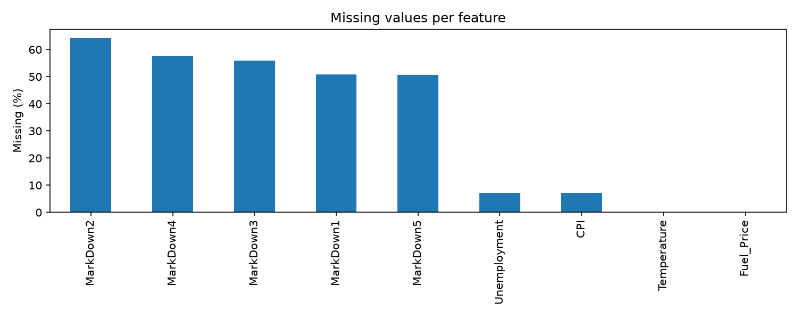

# ml-final-project-walmart-recruiting

## მონაცემების წინასწარი დამუშავება

### NaN მნიშვნელობები

- `MarkDown1`–`MarkDown5` — NaN მნიშვნელობები შეივსება 0-ით, რადგან NaN ნიშნავს რომ მოცემულ კვირაში ფასდაკლება არ ყოფილა.
- `CPI`, `Unemployment` — შეივსება Forward filling / Backward filling მეთოდის გამოყენებით თითოეული მაღაზიისთვის ცალ-ცალკე, რადგან ისინი დროზე დამოკიდებული ცვლადებია.
- `Temperature`, `Fuel_Price` — არ გვაქვს NaN მნიშვნელობები.

## Feature Engineering For All Models

ქვემოთ მოცემული პუნქტები აღწერს როგორ ვამუშავებთ მონაცემებს ყველა მოდელისთვის. თუმცა კონკრეტულ მოდელს შეიძლება კიდევ დამატებით სხვანაირად დასჭირდეს მონაცემთა დამუშავება, ამიტომ ასეთი ტიპის გარდაქმნებს თვითონ ამ მოდელის განხილვის დროს აღვწერთ.

### 1. დროის ცვლადები

ვინაიდან საცალო ვაჭრობა მკვეთრად სეზონურია, ყველა მოდელისთვის სასარგებლოა იმის ცოდნა, კვირა წლის რომელ მონაკვეთში ხვდება. გაყიდვებზე დიდ გავლენას ახდენს დროის პერიოდში არსებული მნიშვნელოვანი მოვლენები (Holidays - ახალი წელი, მადლიერების დღე და ა.შ.)

**დამატებული სვეტები (`add_time_features`):**

იმისათვის რომ თითოეულ მაღაზიაზე და დეპარტამენტზე მოცემული თარიღები მოდელისთვის უფრო აღქმადი იყოს დავამატეთ ცვლადები:
- `Year`, `Month`, `WeekOfYear` - თარიღის ძირითადი დაშლა რიცხვით კომპონენტებად.

საინტერესოა იმ ფაქტის ცოდნა თუ რამდენად ახლოს ვართ რომელიმე მნიშვნელოვან მოვლენასთან. მაგალითად გაყიდვები იზრდება ახალი წლისთვის სამზადისის პერიოდში. ეს პერიოდი გავლენას ახდენს გაყიდვებზე თუმცა მხოლოდ `IsHoliday` ცვლადით ვერ გავითვალისწინებდით მათ. ამის გამო გადავწყვიტეთ დავამატოთ ცვლადები:

- `DaysSinceLastHoliday` - რამდენი დღე გავიდა ბოლო მნიშვნელოვანი მოვლენიდან. 
- `DaysToNextHoliday` - რამდენი დღე დარჩა შემდეგ მნიშვნელოვან მოვლენამდე. 

### 2. მაღაზიის მონაცემები

**დამატებული სვეტები (`add_store_features`):**

- `Type_A`, `Type_B`, `Type_C` - მაღაზიის ტიპის One-hot encoding-ის გამოყენებით, რადგან 3 ტიპი გვაქვს მაღაზიებისთვის და მხოლოდ 3 boolean სვეტის დამატება გვიწევს.
- `Size` - მაღაზიის ფართობი.

### 3. IsHoliday კოდირება

**(`encode_is_holiday`):**

`IsHoliday` სვეტი თავდაპირველად Boolean არის (`True`/`False`). ყველა მოდელისთვის გარდავქმნით მას მთელ რიცხვად (`1`/`0`), რათა მოდელმა შეძლოს მისი გამოყენება.

### 4. features.csv-ის დამერჯვა

**(`merge_features`):**

`features.csv` იმერჯება train და test მონაცემებთან `Store` და `Date` სვეტების მიხედვით, რათა თითოეულ სტრიქონს დაემატოს `Temperature`, `Fuel_Price`, `CPI`, `Unemployment` და `MarkDown1`–`MarkDown5`.

## DLinear მოდელი

DLinear გამოვიყენეთ როგორც time-series forecasting მოდელი, რომელიც კარგად ერგება Walmart-ის ტიპის weekly sales forecasting ამოცანას. მონაცემები გადავიყვანეთ `NeuralForecast`-ის long format-ში, რადგან DLinear თითოეულ Store-Dept სერიას ცალკე time series-ად ხედავს:

- `unique_id` - ერთი time-series თითოეული `Store` + `Dept` წყვილისთვის.
- `ds` - კვირის თარიღი.
- `y` - სამიზნე ცვლადი, ანუ `Weekly_Sales`.

DLinear-ის მთავარი იდეაა, რომ time-series იყოფა ორ ნაწილად: trend კომპონენტად და seasonal/remainder კომპონენტად. შემდეგ ორივე კომპონენტზე გამოიყენება მარტივი linear projection, რომელიც ბოლო ისტორიული ფანჯრიდან პროგნოზირებს მომავალ კვირებს. ეს არქიტექტურა ბევრად უფრო მარტივია, ვიდრე დიდი recurrent ან attention-based მოდელები, მაგრამ ძლიერი baseline არის ისეთი მონაცემებისთვის, სადაც ისტორიული გაყიდვების pattern-ები, სეზონურობა და store-department-ის სპეციფიკური ჩვევები ძალიან მნიშვნელოვანია.

### რატომ ვიყენებთ მხოლოდ ისტორიულ ინფორმაციას

DLinear-ის ამ ექსპერიმენტში მოდელს ვაწვდით მხოლოდ ისტორიულ `Weekly_Sales` მნიშვნელობებს. ანუ, თითოეული `Store-Dept` სერიისთვის მოდელი იღებს წარსული 52 კვირის გაყიდვებს და ამ history-ზე დაყრდნობით პროგნოზირებს შემდეგ 39 კვირას.

DLinear-ის არქიტექტურა ძალიან მარტივია: ის input window-ს შლის trend და seasonal ნაწილებად და შემდეგ linear layer-ების საშუალებით ასახავს ამას მომავალ horizon-ზე. ამ მოდელში არ გვაქვს ცალკე decoder ან attention მექანიზმი, სადაც მომავალ კვირებზე ცნობილი ცვლადები ცალკე შევიდოდა. ამიტომ DLinear-ისთვის ყველაზე ბუნებრივი setup არის history-based forecasting: მოდელი სწავლობს წარსული გაყიდვების pattern-ებს და მომავალის პრედიქციას ახდენს.

ეს მიდგომა სწორია forecast ამოცანისთვის, რადგან validation და test პროგნოზის დროს მოდელმა უნდა გამოიყენოს მხოლოდ ის ინფორმაცია, რომელიც პროგნოზის მომენტში რეალურად ხელმისაწვდომია. 

ამიტომ DLinear-ის საბოლოო ვერსია არის `target_history_only`: input-ში გვაქვს მხოლოდ `unique_id`, `ds` და `y`. ეს არ ნიშნავს, რომ სხვა features უსარგებლოა, უბრალოდ ამ მოდელის მიზანია გვაჩვენოს, რამდენად ძლიერი პროგნოზი შეიძლება მივიღოთ მხოლოდ historical sales pattern-ებიდან.

### Train/Validation setup

DLinear შევაფასეთ time-based validation-ით. მოდელი ვავარჯიშეთ ძველ კვირების ინფორმაციაზე და შემდეგ, ახალ კვირებზე შევამოწმებთ. ასეთი split აუცილებელია forecasting ამოცანაში, რადგან რეალურ ცხოვრებაშიც წარსულით ვცდილობთ მომავლის პროგნოზირებას.

validation setup:

- Train პერიოდი: `2010-02-05`-დან `2012-01-27`-მდე
- Validation პერიოდი: `2012-02-03`-დან `2012-10-26`-მდე
- Input window: `52` კვირა, ანუ მოდელი ყოველი პროგნოზისთვის უყურებს ბოლო ერთ წელს
- Forecast horizon: `39` კვირა, რაც ემთხვევა test set-ის კვირების რაოდენობას
- Frequency: weekly Friday (`W-FRI`)

მონაცემებში ყველა `Store-Dept` სერიას ერთნაირი რაოდენობის კვირები არ ჰქონდა. DLinear-ის cross-validation რომ სტაბილურად გაშვებულიყო, train/evaluation ნაწილში გამოვიყენეთ სრული ისტორიის მქონე სერიები:

- სულ Store-Dept time series: `3331`
- სრული ისტორიის მქონე რიგები: `2660`
- მოკლე ან არათანაბარი სერიები, რომლებიც DLinear train/evaluation-იდან ამოვიღეთ: `671`

საბოლოო prediction pipeline-ში მოკლე სერიებისთვის fallback ლოგიკაც დავამატეთ. თუ DLinear კონკრეტულ `Store-Dept` წყვილზე პროგნოზს ვერ აბრუნებს, ვიყენებთ ამ სერიის ბოლო ცნობილ `Weekly_Sales` მნიშვნელობას. თუ არც ეს არსებობს, ვიყენებთ გლობალურ median fallback-ს (`7,612.03`).

### Hyperparameter search

გავუშვით DLinear-ის რამდენიმე configuration და ისინი დავყავით underfit/balanced/overfit.

ასეთი დაყოფა დაგვეხმარა გვენახა, როგორ რეაგირებს DLinear სხვადასხვა სირთულის setup-ზე. Underfit configuration-ები გვაჩვენებს შემთხვევებს, სადაც მოდელი ზედმეტად მარტივია და historical pattern-ებს საკმარისად ვერ სწავლობს. Overfit configuration-ები პირიქით, გვაჩვენებს შემთხვევებს, სადაც მოდელი train მონაცემს ზედმეტად ერგება და validation-ზე უარესად მუშაობს. Balanced configuration-ების მიზანი იყო ამ ორ უკიდურესობას შორის უკეთესი trade-off-ის პოვნა, სადაც validation WMAE ყველაზე დაბალია.

ამ შედარებამ გვაჩვენა, რომ DLinear-ისთვის საუკეთესო შედეგი არ მოდის უბრალოდ უფრო დიდი ან უფრო ხანგრძლივად ნავარჯიშები მოდელიდან. უკეთესი შედეგი მივიღეთ მაშინ, როცა input window, moving average window და training steps ერთმანეთთან დაბალანსებული იყო.

ეს ბალანსი შემთხვევით არ აგვირჩევია. საუკეთესო configuration იყო ის, სადაც მოდელს საკმარისი ისტორია ჰქონდა სასარგებლო pattern-ების დასასწავლად, მაგრამ არც ისე დიდი complexity ან training steps, რომ train set-ზე ზედმეტად მორგებულიყო.

ძირითადი tuning parameters იყო:

- `input_size`
- `moving_avg_window`
- `max_steps`
- `learning_rate`
- `batch_size`

საუკეთესო run იყო `balanced_2`:

| პარამეტრი | მნიშვნელობა |
|---|---:|
| `input_size` | `52` |
| `moving_avg_window` | `13` |
| `max_steps` | `500` |
| `learning_rate` | `0.001` |
| `batch_size` | `128` |
| Validation WMAE | `2,555.44` |

WMAE გამოვიყენეთ როგორც მთავარი metric, რადგან Walmart-ის competition-ის შეფასებაშიც holiday weeks უფრო მაღალი წონით ფასდება. ეს მნიშვნელოვანია, რადგან holiday periods გაყიდვებზე ძლიერ გავლენას ახდენს და ასეთ კვირებში მოდელის შეცდომა უფრო დიდ გავლენას ახდენს საბოლოო შეფასებაზე.

### DLinear plots

ქვემოთ მოცემული plot აჩვენებს DLinear runs-ის შედარებას validation WMAE-ის მიხედვით. მთავარი მიზანი იყო გვეპოვა ის hyperparameter configuration, რომელსაც held-out validation პერიოდზე ყველაზე დაბალი შეცდომა ჰქონდა. საუკეთესო შედეგი მიიღო `balanced_2` configuration-მა.

შემდეგი plot აჩვენებს იმ Store-Dept წყვილებს, სადაც validation error ყველაზე მაღალი იყო. ყველაზე რთული სერიები აღმოჩნდა, მაგალითად, `(10, 72)`, `(14, 92)`, `(20, 72)`, `(35, 72)` და `(18, 92)`. ასეთი error analysis მნიშვნელოვანია, რადგან overall WMAE კარგ სურათს გვაძლევს, მაგრამ კონკრეტული პრობლემური departments აჩვენებს სად შეიძლება დაგვჭირდეს დამატებითი feature engineering ან სხვა მოდელის გამოყენება.

Holiday vs non-holiday error-იც რომ შევადაროთ:

- Non-holiday MAE: `2,565.99`
- Holiday MAE: `2,516.43`

ეს ნიშნავს, რომ DLinear-ს holiday კვირებზე არ ჰქონია მკვეთრად უარესი performance. ასეთი შედეგი ლოგიკურია, რადგან historical `Weekly_Sales` უკვე შეიცავს recurring holiday spikes-ს და DLinear-ს შეუძლია ამ pattern-ის ნაწილის დაჭერა მხოლოდ target history-დანაც.

### დასკვნა

DLinear ამ პროექტში გამოვიყენეთ როგორც history-based forecasting baseline. მისი მიზანი იყო გვენახა, რამდენად კარგად შეგვიძლია Walmart-ის weekly sales-ის პროგნოზირება მხოლოდ წარსული გაყიდვების დინამიკით, დამატებითი exogenous features-ის გარეშე.

საუკეთესო DLinear configuration-მა validation-ზე მიიღო `2,555.44` WMAE. ეს შედეგი აჩვენებს, რომ historical `Weekly_Sales` უკვე შეიცავს ბევრ მნიშვნელოვან სიგნალს: სეზონურობას, holiday uplift-ს, department-specific behavior-ს და store-level demand pattern-ებს. ანუ, მიუხედავად იმისა, რომ მოდელი არ იყენებს `Temperature`, `Fuel_Price`, `CPI`, `Unemployment` ან `MarkDown` features-ს, მხოლოდ გაყიდვების history-დან მაინც შეუძლია ძლიერი პროგნოზის გაკეთება.

DLinear-ის მთავარი უპირატესობა მისი სიმარტივეა. მოდელი სწრაფად train-დება, მარტივად კონტროლდება და კარგი benchmark-ია უფრო რთულ მოდელებთან შედარებისთვის. თუ უფრო კომპლექსური მოდელი DLinear-ზე უკეთეს შედეგს ვერ აჩვენებს, მაშინ დამატებითი სირთულე შეიძლება არც გვიღირდეს.
